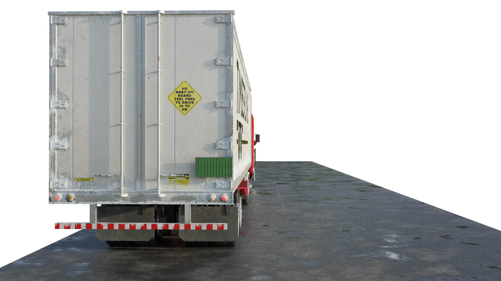
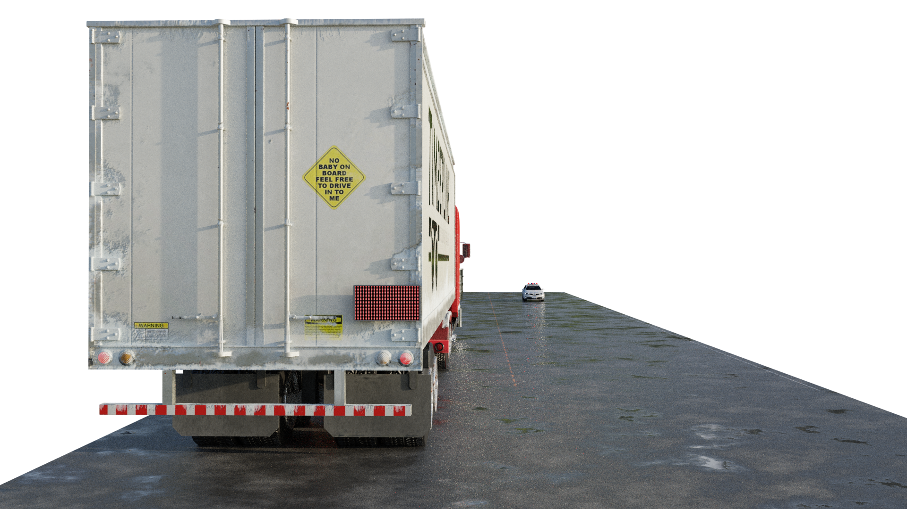

[](https://colab.research.google.com/github/amalazimroshan/volkswagon/blob/main/object_detection_depth_estimation_colab.ipynb)]

## SafePass

SafePass is a project aimed at enhancing road safety by providing real-time information to drivers about the feasibility of overtaking a large vehicle, such as a truck. The system utilizes machine learning, computer vision, and vehicle dynamics to calculate and display a safety signal on the back of the truck, helping following drivers make informed decisions.

#### Features

- Object Detection: Utilizes PyTorch and OpenCV for real-time detection of vehicles in front of the large vehicle.

- Distance and Speed Calculation: Determines the distance between the large vehicle and the detected vehicles, as well as the speed of the large vehicle.

- Safety Signal: Displays a dynamic red or green signal on the back of the large vehicle based on calculated safety parameters, indicating whether it's safe to overtake.




### Why SafePass?

#### Road Safety Impact
According to World Health Organization, road traffic injuries are the leading cause of death among young people aged 5–29. SafePass aims to contribute to reducing accidents related to overtaking, a common cause of road incidents.

#### Overtaking Statistics
In a study conducted by National Highway Traffic Safety Administration (NHTSA), improper overtaking maneuvers contribute significantly to road accidents. SafePass addresses this issue by providing real-time safety information.


### Getting Started

To run this notebook on google colab
click here: https://colab.research.google.com/github/amalazimroshan/volkswagon/blob/main/object_detection_depth_estimation_colab.ipynb

Clone the repository and install dependencies

```
git clone https://github.com/amalazimroshan/volkswagon.git

pip install -r requirements.txt
```
